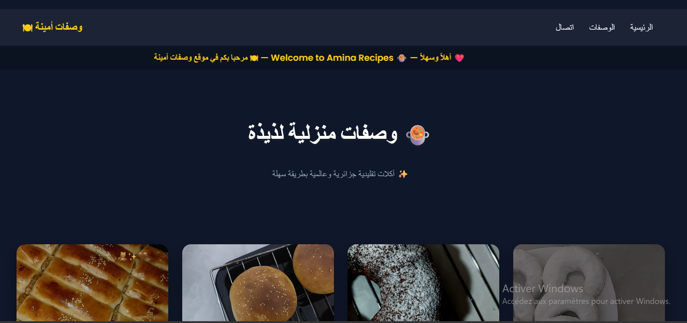

# Recipes Website 🍲

Site web dédié au partage de recettes culinaires, offrant une interface simple et agréable pour découvrir différentes préparations.

## 🔧 Technologies

HTML, CSS, JavaScript

## ✨ Fonctionnalités

* Affichage de plusieurs recettes
* Présentation des ingrédients et étapes de préparation
* Interface claire et facile à utiliser
* Design responsive (adapté aux différents écrans)

## 📌 Description

Ce projet a été conçu pour proposer une plateforme simple de consultation de recettes, avec une mise en page organisée permettant aux utilisateurs de naviguer بسهولة entre les différentes recettes.

## 🚧 État du projet

Projet évolutif avec possibilité d’ajouter des fonctionnalités dynamiques (recherche, filtres, base de données).

